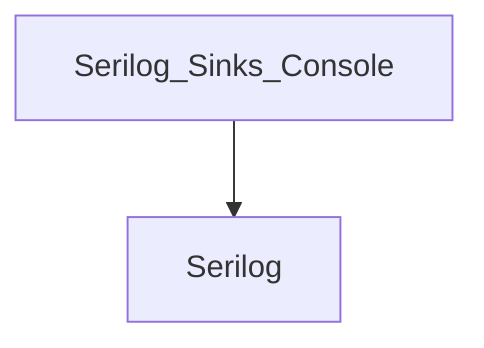
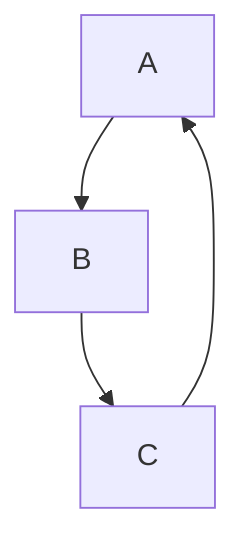

# Визуализатор графа зависимостей NuGet-пакетов

Простой CLI-инструмент на Python для анализа и визуализации зависимостей NuGet-пакетов **без использования готовых менеджеров пакетов и сторонних библиотек**.

Инструмент:
- Собирает прямые и транзитивные зависимости пакета,
- Обнаруживает циклические зависимости,
- Поддерживает фильтрацию по подстроке,
- Строит граф обратных зависимостей,
- Генерирует схему в формате **Mermaid** для визуализации.

## Этапы реализации

 **Этап 1** — Чтение конфигурации из `config.json` с обработкой ошибок  
 **Этап 2** — Сбор прямых зависимостей из NuGet или тестового JSON-файла  
 **Этап 3** — Построение полного графа рекурсивным DFS, обнаружение циклов  
 **Этап 4** — Поиск обратных зависимостей (кто зависит от заданного пакета)  
 **Этап 5** — Визуализация в формате Mermaid

## Требования

- Python 3.10 или выше
- Никаких сторонних библиотек — только стандартная библиотека Python

## Структура проекта

```
.
├── main.py                # Основной скрипт
├── config.json            # Конфигурация
└── test_repo.json         # (опционально) Тестовый граф зависимостей
```

## Как использовать

### 1. Создайте `config.json`

**Пример для реального пакета:**
```json
{
  "package_name": "Serilog.Sinks.Console",
  "repository": "https://api.nuget.org/v3/index.json",
  "mode": "nuget",
  "filter_substring": "System."
}
```

**Пример для тестового режима:**
```json
{
  "package_name": "A",
  "repository": "test_repo.json",
  "mode": "test",
  "filter_substring": ""
}
```

> 💡 `"filter_substring"` — если не пустая строка, исключает пакеты, содержащие эту подстроку (например, `"System."`).

### 2. (Опционально) Создайте `test_repo.json`

Пример:
```json
{
  "A": ["B", "C"],
  "B": ["D"],
  "C": [],
  "D": ["A"]
}
```

### 3. Запустите

```bash
python main.py
```

## Пример вывода (Mermaid)

Для `Serilog.Sinks.Console`:


Для циклического графа:


> Вы можете скопировать этот код в [Mermaid Live Editor](https://mermaid.live) и увидеть интерактивную схему.

## Особенности реализации

- **NuGet-режим**: Загружает `.nuspec`-файлы напрямую с `api.nuget.org/v3-flatcontainer/`  
- **Парсинг XML**: Используется только `xml.etree.ElementTree` (встроенный в Python)  
- **Кэширование**: Каждый пакет загружается из интернета только один раз  
- **Обработка циклов**: Обнаруживаются с помощью `recursion_stack` в DFS  
- **Обратные зависимости**: Строятся по обратному графу, в пределах уже загруженного дерева

## Примеры использования

| Сценарий | `package_name` | `mode` | Результат |
|--------|----------------|--------|----------|
| Простой пакет | `Newtonsoft.Json` | `nuget` | Пустой граф (нет зависимостей) |
| Логирование | `Serilog.Sinks.Console` | `nuget` | `--> Serilog` |
| Тест с циклом | `A` | `test` | Обнаруживается цикл, показываются обратные зависимости |

## Автор

Яшаев Леон Владиславович/ИКБО-12-24
